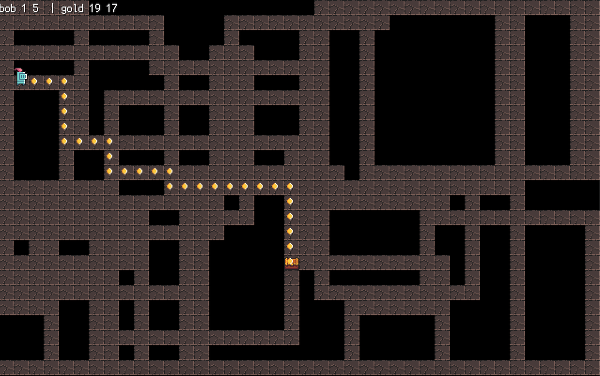

# GOlang A* Pathfinding Algorithm
## UI implemented via the excellent _ebiten_ 2d game library

### WebAssembly (WASM)
Now WASM enabled. Try using `cd server && go run server.go`

### Please use
- Spacebar will generate a new "dungeon"
- P will show the a* path 